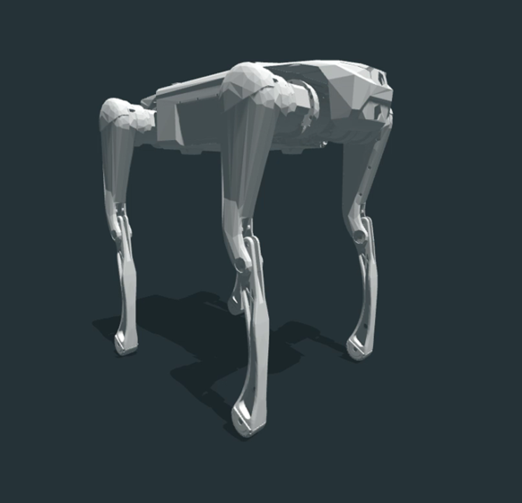
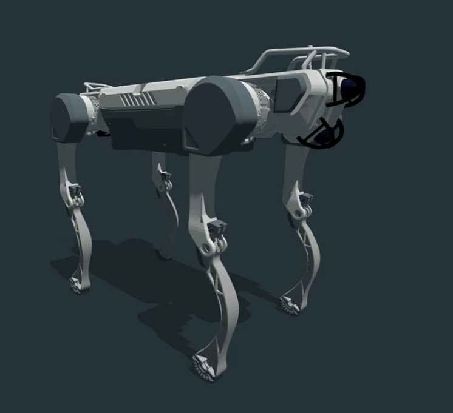
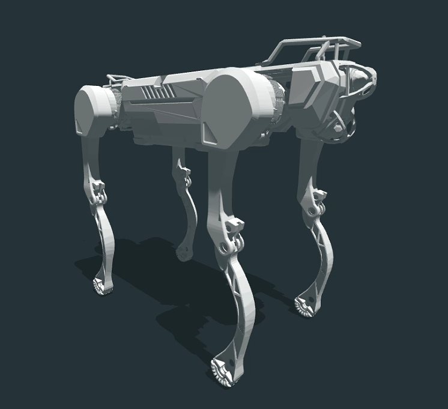
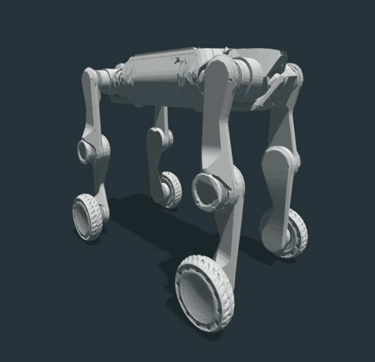

# Robot Models Repository

This repository contains 3D models for three Deep Robotics robots: **Lite3**, **M20**, and **X30**. Each model is provided in MJCF, URDF, and USD formats.

## Model Overview
Note: High resolution models are good for new simulators like isaaclab/isaacsim but old simulators like pybullet cannot open files this big.
### Lite 3
High resolution: Lite3/Lite3_urdf/urdf/Lite3_high_res.urdf

Low resolution: Lite3/Lite3_urdf/urdf/Lite3.urdf

### X30
High resolution: X30/X30_urdf/urdf/X30_high_res.urdf

Low resolution: X30/X30_urdf/urdf/X30.urdf

### M20
High resolution: M20/M20_urdf/urdf/M20_high_res.urdf

Low resolution: M20/M20_urdf/urdf/M20.urdf
